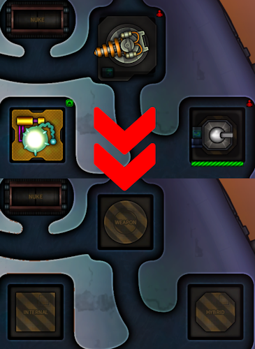

# Shortest Trip To Earth - Show Ship Slots



Toggles the visibility of the slots to make it easier to determine which slots to upgrade. 

Pressing the backlash key will toggle the slot visibility.
The hotkey can be changed in the configuration file.

# Steam Workshop
For Steam Users, subscribing to this mod does not install the mod.
Follow [Installation section](#installation) instructions below to install.

# Notes
When changing a module or changing a preset, the affected modules will be visible.  This is normal.  Simply toggle the visibility again to hide or show all.

When the modules are hidden, the slots can still be upgraded.  Since the modules are still present but invisible, the "select slot" will have to be used as per normal operation.

# Compatibility
* Some mods instruct the user to overwrite the game's original files.  This mod may not be compatible with those mods.
    * This mod does not affect the original game files.
* Safe to add and remove from existing saves.

# Configuration
The configuration file will be created on the first game run and can be found at `<Steam Directory>\steamapps\common\Shortest Trip to Earth\BepInEx\config\ShowShipSlots.cfg`.  The changes will take effect the next time the game is run.

|Name|Default|Description|
|--|--|--|
|ShowSlotKey|Backslash|The key to toggle the visibility of the ship's slots.|

# Support
If you enjoy my mods and want to buy me a coffee, check out my [Ko-Fi](https://ko-fi.com/nbkredspy71915) page.
Thanks!

# Installation 

This section covers how to install the BepInEx mod loader and the mod itself.

## BepInEx Setup
If BepInEx has already been installed, skip to the [Mod Install](#mod-install) section.

* Download BepInEx from https://github.com/BepInEx/BepInEx/releases/download/v5.4.23.2/BepInEx_win_x64_5.4.23.2.zip
* Extract of the BepInEx zip file into the game's directory:
```<Steam Directory>\steamapps\common\Shortest Trip to Earth```
* Move all of the files in the new ```BepInEx_win_x64_5.4.23.2``` folder to the game's root directory.
* If installed correctly, the following folders and files will exist in the game's directory:
```
<Game Directory>
│   doorstop_config.ini
│   ST Earth.exe
├───BepInEx
├───Data
```
* Run the game.  Once the main menu is shown, exit the game.  
* If the install was successful, there will now be a ```<Game Directory>/BepInEx/plugins``` directory.

## Mod Install
* Download the ShowShipSlots.zip.  
    * If on Nexumods.com, download from the Files tab.
    * Otherwise, download from https://github.com/NBKRedSpy/STTE-ShowShipSlots/releases/
* Extract the contents of the zip file into the ```<Game Dir>/BepInEx/plugins``` folder.
* Run the Game.  The mod will now be enabled.

# Uninstalling

## Uninstalling This Mod Only

This method removes this mod, but keeps the BepInEx mod loader and any other mods.

Delete the directory ```<Steam Directory>\steamapps\common\Shortest Trip to Earth\BepInEx\plugins\ShowShipSlots```.

## Uninstall the Mod and BepInEx
This resets the game to an unmodded state by deleting BepInEx and any BepInEx mods.

Delete the following files and folders in the game's directory:
```
BepInEx  (<-- Folder)
.doorstop_version
changelog.txt
doorstop_config.ini
winhttp.dll
```

# Change Log 

## 1.0.1
* Fixed modules being destroyed when selected.

## 1.0.0
* Release

# Source Code
Source code is available on GitHub at https://github.com/NBKRedSpy/STTE-ShowShipSlots
